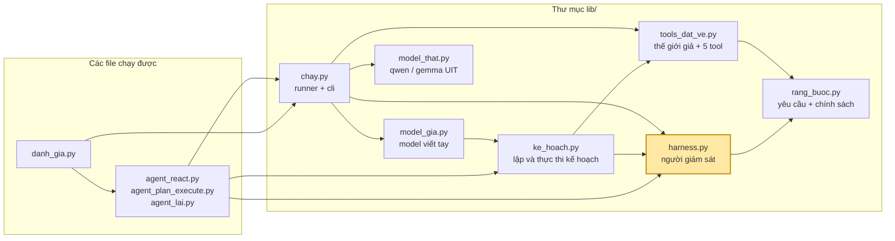
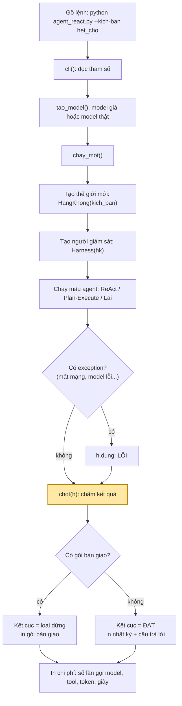
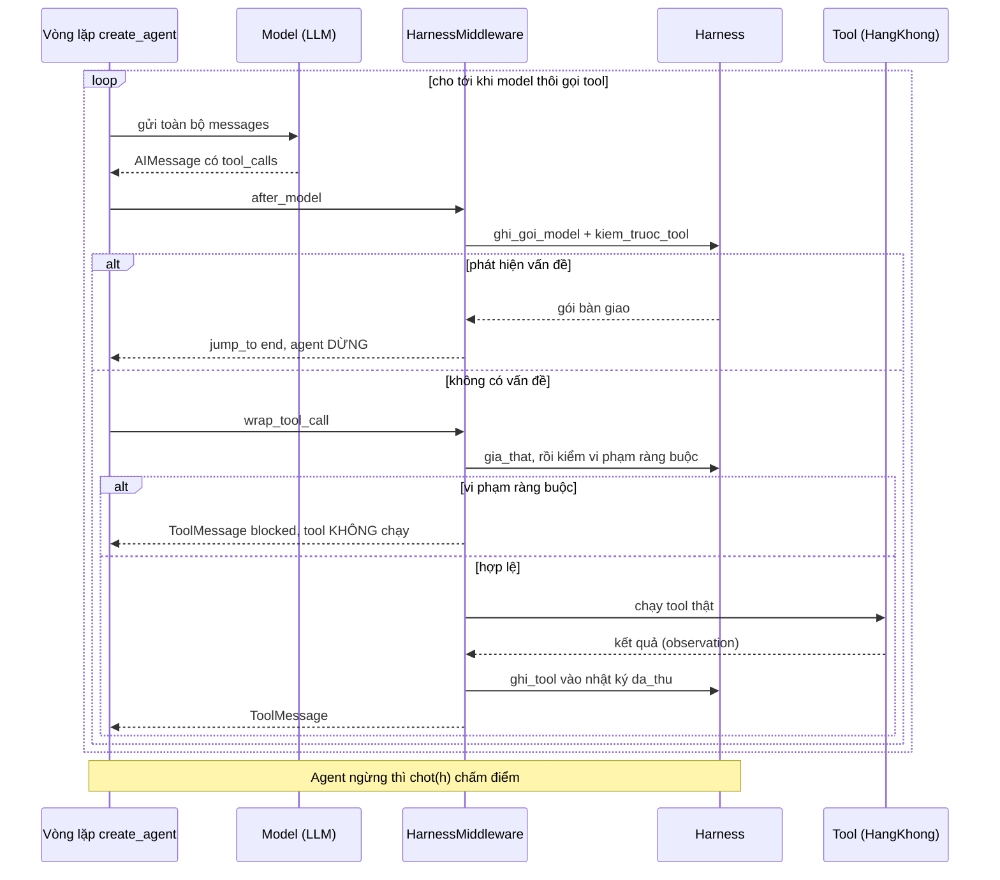
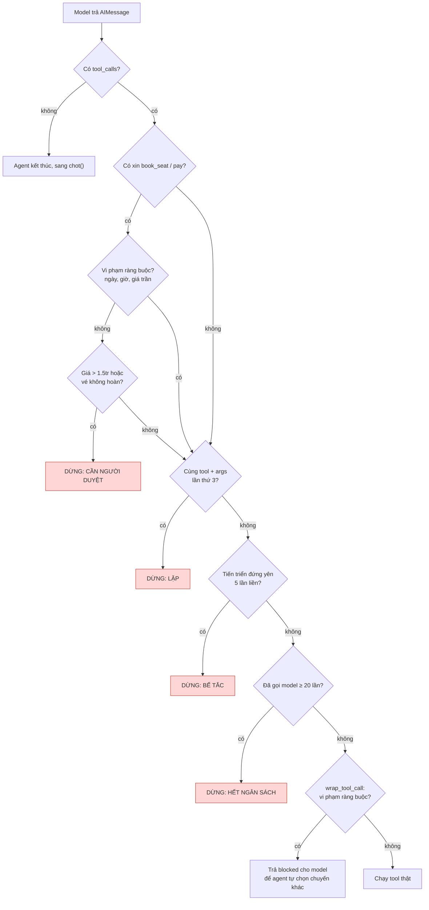
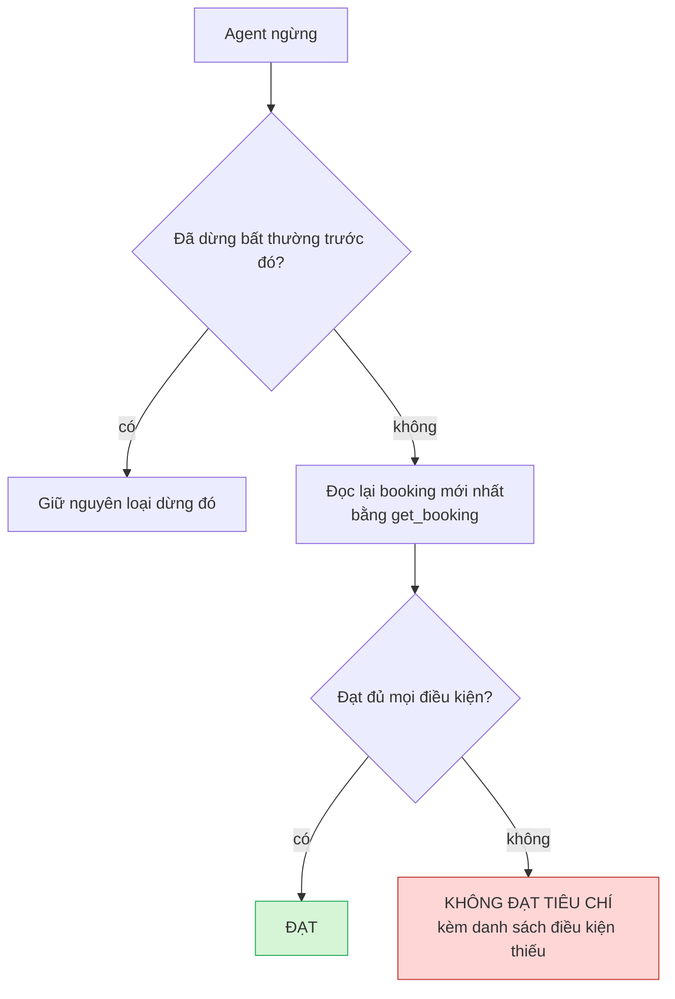
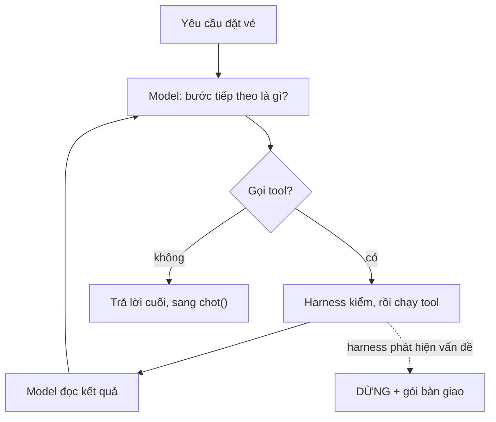
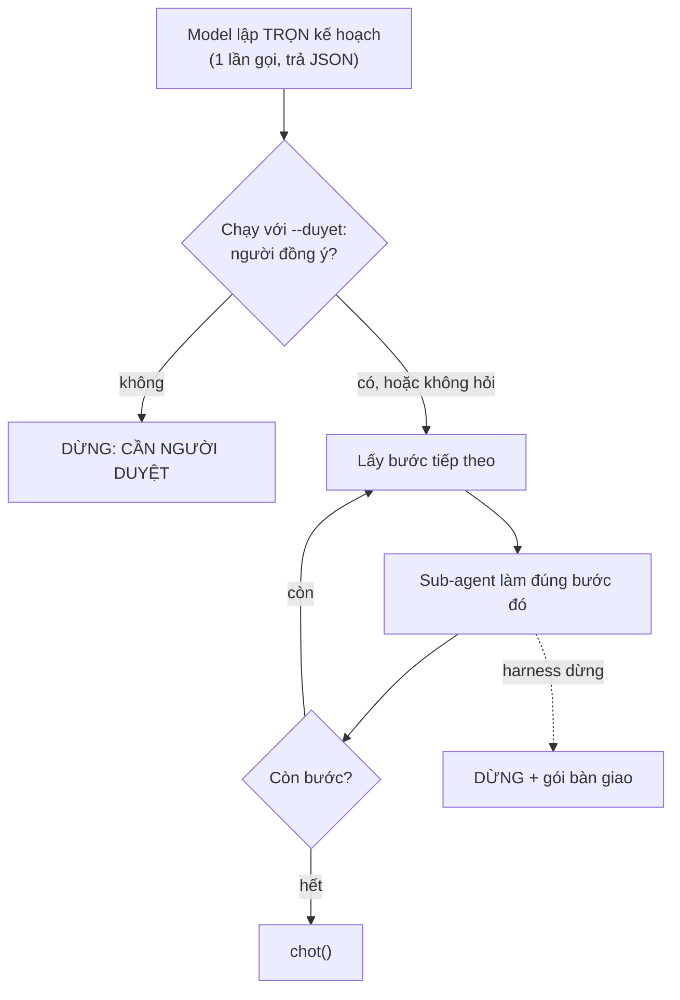
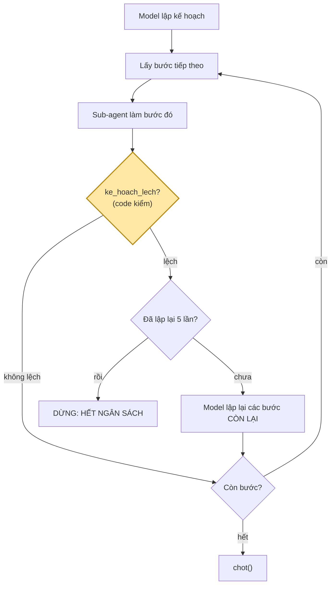

# Giải thích BTVN3: đọc file này trước khi đọc code

> **Xem sơ đồ:** VS Code cần cài extension *Markdown Preview Mermaid Support* (`bierner.markdown-mermaid`), sau đó bấm `Ctrl+Shift+V`. Trên GitHub sơ đồ tự hiển thị.

---

## 1. Tóm tắt trong một câu

Bài này xây một **trợ lý đặt vé máy bay bằng LLM** theo **3 cách làm việc khác nhau** (ReAct, Plan-then-Execute, Lai). Cả 3 chạy trên **cùng 5 tình huống**, đều có một **người giám sát (harness)** canh chừng, và cuối cùng được **chấm điểm** để xem cách nào xử lý đúng hơn, tốn ít hơn.

### Ẩn dụ để dễ nhớ

| Trong code | Ngoài đời |
|---|---|
| `HangKhong` (gọi tắt `hk`) | quầy vé giả của hãng bay |
| 5 tool | 5 nút bấm trên quầy vé |
| model (LLM) | nhân viên đặt vé, có thể làm sai |
| 3 mẫu agent | 3 kiểu làm việc của nhân viên |
| `Harness` (gọi tắt `h`) | quản lý đứng sau lưng, được quyền ngắt bất cứ lúc nào |
| `YEU_CAU`, `CHINH_SACH` | tờ yêu cầu của sếp và quy định công ty |
| `KICH_BAN` | 5 "ngày làm việc" khác nhau: bình thường, hết chỗ, tăng giá... |
| `danh_gia.py` | buổi chấm điểm cuối tháng |

---

## 2. Đề bài: agent phải làm gì

**Yêu cầu** (trong `lib/rang_buoc.py` → `YEU_CAU`): đặt 1 vé **SGN → DAD ngày 07/10**, bay **trước 12:00**, giá **không quá 2.000.000đ**.

**Chính sách công ty** (`CHINH_SACH`): nếu giá **trên 1.500.000đ** hoặc vé **không hoàn được** thì phải **hỏi người duyệt** trước khi đặt.

**Quy trình đúng** gồm 5 tool, gọi theo thứ tự:

```
search_flights → check_seat → book_seat → pay → get_booking
   (tìm)         (giá thật)   (giữ chỗ)  (trả tiền) (đọc lại xác nhận)
```

| Tool | Loại | Ghi chú |
|---|---|---|
| `search_flights` | chỉ đọc | trả về **giá tham khảo** (`gia_tham_khao`), có thể không đúng giá thật |
| `check_seat` | chỉ đọc | trả về **giá thật** (`price`), số ghế còn lại, vé hoàn được không |
| `book_seat` | **có tác dụng phụ** | giữ một ghế và tạo mã đặt chỗ `BK100`, `BK101`... |
| `pay` | **có tác dụng phụ** | trừ tiền thẻ công ty, ngoài đời không hoàn tác được |
| `get_booking` | chỉ đọc | đọc lại booking để kiểm chứng |

**5 chuyến bay** có sẵn (kịch bản bình thường):

| Chuyến | Giờ | Giá | Thoả yêu cầu? | Cần duyệt? |
|---|---|---|---|---|
| VJ604 | 06:15 | 1.300.000 | ✅ | không |
| QH118 | 09:40 | 1.400.000 | ✅ | không |
| VJ612 | 11:05 | 1.600.000 | ✅ | có, vì > 1.5tr |
| VN122 | 07:30 | 1.850.000 | ✅ | có, vì > 1.5tr |
| VN134 | 14:20 | 1.200.000 | ❌ bay sau 12:00 | — |

---

## 3. Bản đồ file: ai dùng ai



*Mũi tên A → B nghĩa là "A dùng B". `harness.py` được tô màu vì đó là phần lõi của bài.*

| File | Vai trò, nói ngắn |
|---|---|
| `lib/rang_buoc.py` | **Nguồn sự thật duy nhất** về yêu cầu và chính sách. Prompt, kiểm ràng buộc, kiểm quyền và tiêu chí hoàn thành đều đọc từ đây. |
| `lib/tools_dat_ve.py` | Thế giới giả `HangKhong`, 5 tool, 5 kịch bản `KICH_BAN` |
| `lib/harness.py` | `Harness` là bộ não giám sát. `HarnessMiddleware` là phích cắm để gắn bộ não đó vào LangChain |
| `lib/chay.py` | `chay_mot()` chạy một lần và đo chi phí. `cli()` đọc tham số dòng lệnh |
| `lib/ke_hoach.py` | Khối dựng cho 2 mẫu có kế hoạch: lập kế hoạch, thực thi một bước, kiểm lệch, lập lại |
| `lib/model_gia.py` | **Không phải LLM**, chỉ là luật viết tay để chạy thử khi không có mạng UIT |
| `lib/model_that.py` | Gọi model thật qwen/gemma của UIT |
| `agent_*.py` | 3 mẫu agent, mỗi file khoảng 30 dòng |
| `danh_gia.py` | Chạy 3 mẫu × 5 kịch bản rồi xuất bảng điểm ra `ket_qua/` |

---

## 4. Một lần chạy, từ lúc gõ lệnh đến lúc in kết quả



**Ý chính:** mỗi lần chạy có **thế giới riêng và harness riêng**, nên các lần chạy không ảnh hưởng lẫn nhau. Đó là điều kiện để so sánh 3 mẫu một cách công bằng.

---

## 5. Bên trong vòng lặp agent: harness chen vào ở đâu

Model **không tự chạy tool**. Nó chỉ trả về một "phiếu yêu cầu" `tool_call` có dạng `{"name": "book_seat", "args": {"flight_id": "VJ604"}}`. `HarnessMiddleware` chặn ở **2 điểm**: ngay sau khi model trả lời (`after_model`) và ngay trước khi tool chạy (`wrap_tool_call`).



**Vì sao có 2 class `Harness` và `HarnessMiddleware`?** `Harness` giữ **trạng thái** (bộ đếm, nhật ký, bộ phát hiện lặp) và **luật kiểm tra**. `HarnessMiddleware` chỉ là phích cắm vào LangChain. Plan-then-Execute và Lai tạo **một sub-agent mới cho mỗi bước**, nhưng mọi sub-agent dùng **chung một `Harness`**, nhờ vậy ngân sách và nhật ký được cộng dồn qua tất cả các bước.

---

## 6. Harness kiểm những gì

### 6a. Trước khi tool chạy



Ba chỗ hay bị nhầm:

- **Vi phạm ràng buộc thì không hỏi người.** Vé đã sai yêu cầu thì có hỏi người duyệt cũng vô ích. Harness chặn tool đó và trả `blocked` để agent tự sửa. Chỉ khi vé **hợp lệ nhưng đắt hoặc không hoàn được** thì mới hỏi người.
- **LẶP:** `get_booking` được miễn (`KHONG_KIEM_LAP`), vì gọi lại để chờ trạng thái là chuyện bình thường. Ngưỡng là 3 lần, nghĩa là cho phép thử lại 1 lần khi tool timeout.
- **Tiến triển (0–4)** là số mục đã đạt trong 4 mục: đã tìm, đã thấy chuyến hợp lệ còn ghế, đã giữ chỗ, đã trả tiền. Hàm `tien_trien()` cộng các giá trị True/False bằng `sum` (True = 1).

### 6b. Khi agent nói đã xong: `chot()`



Các điều kiện (`tieu_chi_hoan_thanh` trong `rang_buoc.py`): có booking, `status == confirmed`, đã thanh toán, đúng chặng SGN→DAD, đúng ngày 07/10, giờ bay < 12:00, giá ≤ 2tr, và **giá khớp với giá `check_seat` đã báo**.

> **Nguyên tắc của cả bài: không tin lời model tự nói.** Model có trả lời "Đã đặt vé xong!" thì code vẫn đọc lại booking để tự kiểm.

### Tất cả các kết cục có thể có

| Kết cục | Ai quyết định | Khi nào |
|---|---|---|
| **ĐẠT** | `chot` | đạt đủ mọi điều kiện |
| **KHÔNG ĐẠT TIÊU CHÍ** | `chot` | agent ngừng nhưng booking chưa đúng, hoặc chưa có booking |
| **CẦN NGƯỜI DUYỆT** | harness, hoặc người bấm "n" khi chạy `--duyet` | vé > 1.5tr hoặc không hoàn được |
| **LẶP** | harness | cùng tool + args lần thứ 3 |
| **BẾ TẮC** | harness | tiến triển đứng yên 5 lần |
| **HẾT NGÂN SÁCH** | harness, hoặc agent Lai | ≥ 20 lần gọi model, hoặc đã lập lại kế hoạch 5 lần |
| **LỖI KẾ HOẠCH** | `ke_hoach.py` | model không trả JSON kế hoạch đúng định dạng |
| **LỖI** | `chay.py` | có exception (mất mạng...) |

Mọi kết cục khác ĐẠT đều kèm một **gói bàn giao** gồm: đã thử những gì (`da_thu`), tiến triển `x/4`, các tác dụng phụ đã xảy ra (đã giữ chỗ, đã trả tiền chưa), và câu hỏi cho người tiếp quản. Agent **không bao giờ dừng im lặng**.

---

## 7. Ba mẫu agent

### Mẫu 1: ReAct (`agent_react.py`)

Không có kế hoạch. Sau mỗi bước, model nhìn kết quả rồi tự chọn bước tiếp theo.



### Mẫu 2: Plan-then-Execute (`agent_plan_execute.py`)

Lập **trọn kế hoạch một lần**, sau đó làm lần lượt từng bước. **Kế hoạch không bao giờ thay đổi.**



### Mẫu 3: Lai (`agent_lai.py`)

Có kế hoạch như mẫu 2, nhưng **nếu kết quả lệch thì lập lại kế hoạch cho phần còn lại**. Việc quyết định "có lệch không" do **code** làm, không tốn lần gọi model.



`ke_hoach_lech` trả về "lệch" khi gặp một trong các trường hợp: bước vừa làm không gọi được tool nào, tool trả `status` khác `ok`, hoặc `check_seat` cho thấy hết ghế hay giá vượt trần.

### So sánh nhanh

| | ReAct | Plan-then-Execute | Lai |
|---|---|---|---|
| Lập kế hoạch trước | không | có, 1 lần | có |
| Đổi hướng giữa chừng | mỗi bước tự chọn | **không bao giờ** | khi code thấy lệch |
| Điểm mạnh | linh hoạt | duyệt trước được, đoán trước được sẽ làm gì | vừa có kế hoạch vừa tự sửa được |
| Điểm yếu | khó biết trước nó sẽ làm gì | **kế hoạch lỗi thời thì hỏng** | tốn nhiều lần gọi model nhất |

---

## 8. Năm kịch bản: mỗi kịch bản là một cái bẫy

`KICH_BAN` chỉ ghi **phần khác so với mặc định**. Ví dụ `het_cho` chỉ đặt số ghế của VJ604 về 0.

| Kịch bản | Thay đổi gì | Cái bẫy | Kết cục đúng |
|---|---|---|---|
| `binh_thuong` | không đổi gì | không có, dùng làm mốc so sánh | **ĐẠT** (đặt VJ604) |
| `het_cho` | VJ604 hết ghế | kế hoạch lập sẵn "đặt VJ604" bị lỗi thời | **ĐẠT** (chuyển sang QH118) |
| `vuot_gia` | 4 chuyến buổi sáng có giá thật > 2tr | giá tham khảo rẻ nhưng giá thật đắt | **KHÔNG ĐẠT TIÊU CHÍ** (không có chuyến nào thoả) |
| `loi_timeout` | `check_seat(VJ604)` luôn timeout | thử lại mãi không dừng | **LẶP** |
| `can_duyet` | VJ604 giá 1.95tr, không hoàn | đặt luôn mà không hỏi người | **CẦN NGƯỜI DUYỆT** |

---

## 9. Kết quả chấm điểm (model giả) và vì sao Plan-then-Execute trượt

| Mẫu | Đúng kỳ vọng | TB gọi model | Lần trả tiền sai |
|---|---|---|---|
| ReAct | 5/5 | 5.2 | 0 |
| Plan-then-Execute | **3/5** | 10.0 | **1** |
| Lai | 5/5 | 11.6 | 0 |

> ⚠️ Bảng này chạy bằng **model giả**, tức luật viết tay. Nó chỉ chứng minh harness và cách nối các phần chạy đúng, **không phải** bằng chứng mẫu nào hiệu quả hơn. Muốn đánh giá thật thì chạy `python danh_gia.py --that qwen --so-lan 3` trong mạng nội bộ UIT.

**Trượt kịch bản `het_cho`:** kế hoạch cố định là check VJ604, book VJ604, pay, get_booking. VJ604 hết ghế nên `book_seat` báo `sold_out`, các bước sau cũng hỏng. Vì kế hoạch không đổi nên agent không bao giờ thử QH118. Kết cục là KHÔNG ĐẠT TIÊU CHÍ. Agent Lai thì thấy `seats_left = 0`, coi đó là lệch, lập lại kế hoạch và đặt được QH118.

**Trượt kịch bản `loi_timeout`, và đây là lỗi nặng hơn:** `check_seat(VJ604)` bị timeout, nhưng mỗi bước chỉ chạy một lần nên không đủ 3 lần để harness bắt LẶP. Agent cứ thế `book_seat` rồi **`pay` cho VJ604** dù chưa từng thấy giá thật. Sau đó `chot` báo KHÔNG ĐẠT, vì điều kiện "giá khớp giá `check_seat` đã báo" không thoả. Kết quả là **tiền đã bị trừ mà vé không được chấp nhận**, và đó chính là con số "Lần trả tiền sai = 1".

---

## 10. Từ điển nhanh

| Tên | Nghĩa |
|---|---|
| `hk` | **h**ãng **k**hông, tức object `HangKhong`, thế giới giả của một lần chạy |
| `h` | object `Harness` của một lần chạy |
| `ai` | `AIMessage`, tin nhắn model trả về (gồm `content`, `tool_calls`, `usage_metadata`) |
| `cli` | **c**ommand-**l**ine **i**nterface, phần đọc tham số `--kich-ban`, `--that`, `--duyet` |
| `tool_call` | phiếu yêu cầu gọi tool của model, gồm `name` (tên tool) và `args` (tham số do model điền) |
| observation | kết quả tool trả về cho model, luôn có trường `status` |
| tác dụng phụ | hành động làm thay đổi thế giới (`book_seat`, `pay`), không hoàn tác được |
| `gia_tham_khao` / `price` | giá quảng cáo (từ `search_flights`) / giá thật (từ `check_seat`) |
| `gia_da_bao` | các giá mà `check_seat` đã báo cho agent, dùng để kiểm chéo khi chấm điểm |
| `da_thu` | nhật ký các tool đã gọi, mỗi dòng có dạng `tool(args) → kết quả` |
| `tien_trien` | số từ 0 đến 4, số mục đã đạt trong quy trình |
| gói bàn giao | thông tin để lại khi agent dừng bất thường: đã thử gì, tới đâu, đã tiêu tiền chưa, cần hỏi người gì |
| sub-agent | agent ReAct nhỏ chỉ làm **một bước** của kế hoạch (trong `thuc_thi_buoc`) |

---

## 11. Thứ tự đọc code (sau khi đã đọc xong file này)

1. `lib/rang_buoc.py`: đề bài
2. `lib/tools_dat_ve.py`: thế giới và 5 kịch bản
3. `agent_react.py`: mẫu đơn giản nhất, coi harness là hộp đen
4. `lib/harness.py`: phần lõi, đọc kèm sơ đồ ở mục 5 và 6
5. `lib/chay.py`: đọc kèm sơ đồ ở mục 4
6. `lib/ke_hoach.py`, sau đó `agent_plan_execute.py` và `agent_lai.py`: mở hai file agent cạnh nhau để so
7. `lib/model_gia.py`, `lib/model_that.py`: có thể bỏ qua ở lần đọc đầu
8. `danh_gia.py` và `ket_qua/danh_gia_model_gia.md`

Muốn tự xem một lần chạy cụ thể thì dùng:

```
python agent_react.py --kich-ban het_cho
python agent_plan_execute.py --kich-ban het_cho
python agent_lai.py --kich-ban het_cho
```

Chạy cả 3 lệnh với cùng một kịch bản là thấy ngay cách làm việc khác nhau của 3 mẫu.
